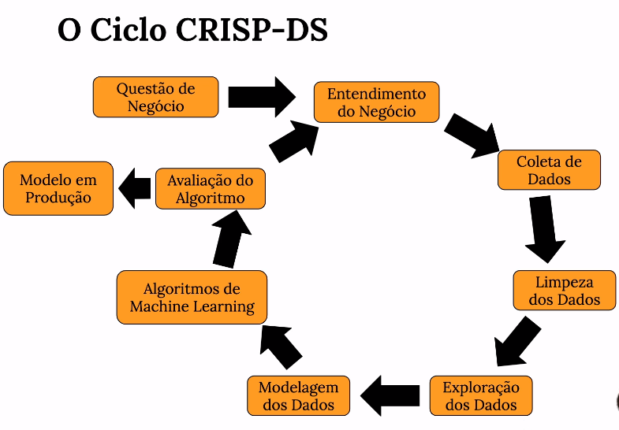
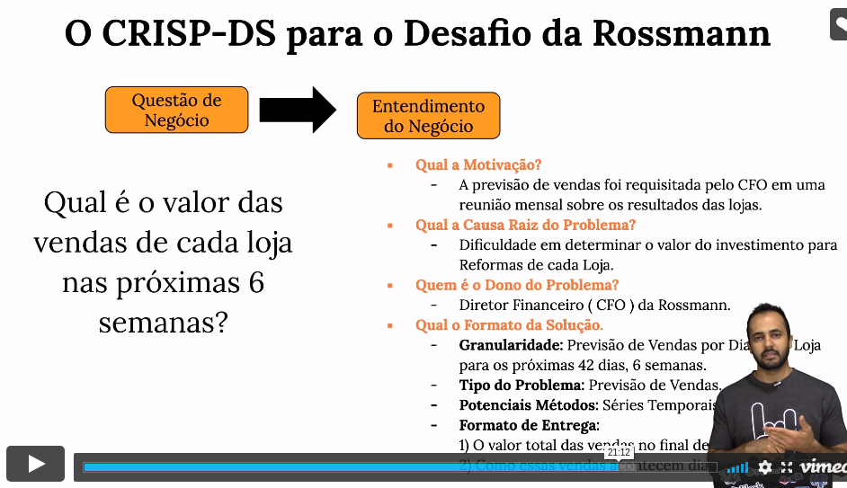

# Módulo 01 - Intro e apresentação do problema

## Os 10 passos de um projeto de Ciência de Dados

* Passo 1: Descrição dos dados
* Passo 2: Feature engineering
* Passo 3: Filtragem de variáveis
* Passo 4: Análise exploratória de Dados (EDA)
* Passo 5: Preparação dos dados
* Passo 6: Seleção de variáveis com algoritmo
* Passo 7: Modelos de Machine Learning
* Passo 8: Hyperparameter Fine tuning
* Passo 9: Interpretação e tradução do erro
* Passo 10: Deploy do modelo em produção

## Como entender o problema de negócio fazendo 4 perguntas?

Entender **a motivação**.

* Qual o contexto?

Entender **a causa raiz do problema**

* Pq fazer uma previsão de vendas?

Entender **quem é o dono do problema**

* Quem será o stakeholder?

Entender **o formato da solução**

* Qual o formato da solução?
	- Granularidade;
	- Tipo do problema;
	- Potenciais métodos;
	- Formato da entrega.
	
## Dataset Rossmann

Rossmann operates over 3,000 drug stores in 7 European countries. Currently, Rossmann store managers are tasked with predicting their daily sales for up to six weeks in advance. Store sales are influenced by many factors, including promotions, competition, school and state holidays, seasonality, and locality. With thousands of individual managers predicting sales based on their unique circumstances, the accuracy of results can be quite varied.

### Data Description

You are provided with historical sales data for 1,115 Rossmann stores. The task is to forecast the "Sales" column for the test set. Note that some stores in the dataset were temporarily closed for refurbishment.

### Files

train.csv - historical data including Sales

test.csv - historical data excluding Sales

sample_submission.csv - a sample submission file in the correct format

store.csv - supplemental information about the stores

### Data fields

Most of the fields are self-explanatory. The following are descriptions for those that aren't.

* **Id** - an Id that represents a (Store, Date) duple within the test set

* **Store** - a unique Id for each store
Sales - the turnover for any given day (this is what you are predicting)

* **Customers** - the number of customers on a given day

* **Open** - an indicator for whether the store was open: 0 = closed, 1 = open

* **StateHoliday** - indicates a state holiday. Normally all stores, with few exceptions, are closed on state holidays. Note that all schools are closed on public holidays and weekends. a = public holiday, b = Easter holiday, c = Christmas, 0 = None

* **SchoolHoliday** - indicates if the (Store, Date) was affected by the closure of public schools

* **StoreType** - differentiates between 4 different store models: a, b, c, d

* **Assortment** - describes an assortment level: a = basic, b = extra, c = extended
CompetitionDistance - distance in meters to the nearest competitor store

* **CompetitionOpenSince[Month/Year]** - gives the approximate year and month of the time the nearest competitor was opened

* **Promo** - indicates whether a store is running a promo on that day

* **Promo2** - Promo2 is a continuing and consecutive promotion for some stores: 0 = store is not participating, 1 = store is participating

* **Promo2Since[Year/Week]** - describes the year and calendar week when the store started participating in Promo2

* **PromoInterval** - describes the consecutive intervals Promo2 is started, naming the months the promotion is started anew. E.g. "Feb,May,Aug,Nov" means each round starts in February, May, August, November of any given year for that store

## Rossmann definindo o problema

* **A motivação:** O CFO requisitou essa solução durante uma reunião de resultados mensais.
* **A causa raiz do problema:** Investimento em reforma das lojas
* **Quem é o stakeholder:** O CFO.
* **O Formato da Solução:** 
	- Vendas diárias em R$ para as próximas 6 semanas;
	- Problema de predição;
	- Time series Regressão e redes neurais;
	- Predições acessadas via bot no telegram.

## O método de gerenciamento CRISP-DS

* Cross Industry Process - Data Science
* Método cíclico de Desenvolvimento
* Você passa várias vezes em todas as etapas do projeto

### Vantagens do CRISP

* 1 ciclo do CRISP completo:
	- 1 versão end-to-end da solução;
	- Velocidade na entrega de valor;
	- Mapeamento de todos os possíveis problemas.
	
### O ciclo CRISP-DS

### O ciclo CRISP - Rossmann

