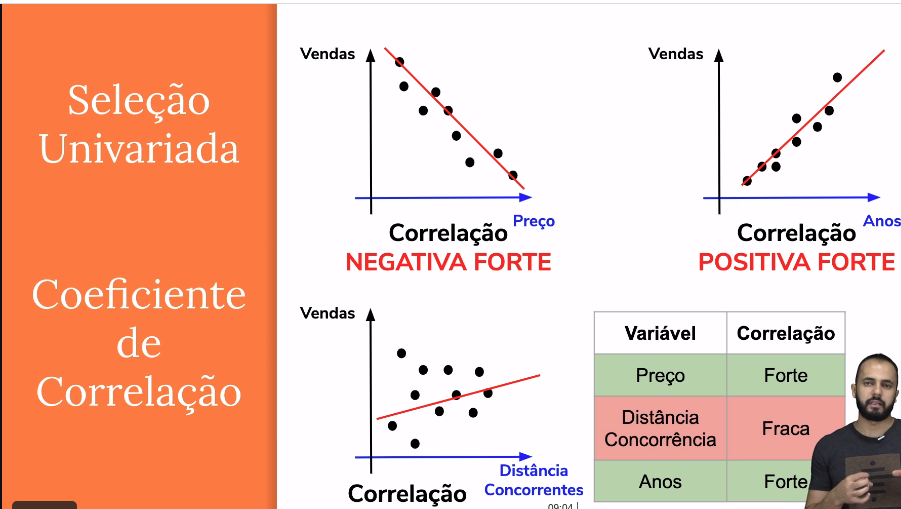

### Módulo 06 - Seleção das Variáveis

#### Feature Selection

Feature selection is the process of reducing the number of input variables when developing a predictive model. It is desirable to reduce the number of input variables to both reduce the computational cost of modeling and, in some cases, to improve the performance of the model.

#### Colinear Variables

A collinearity is a special case when two or more variables are exactly correlated. This means the regression coefficients are not uniquely determined. In turn it hurts the interpretability of the model as then the regression coefficients are not unique and have influences from other features.

We need to eliminate Colinear Variables

#### Métodos de seleção de variáveis  

##### 1. Seleção Univariada (Filter Methods)

##### 2. Seleção por importância (Embedded Methods)

**Definition:** an embedded feature selection method is a machine learning algorithmthat returns a model using a limited number of features. Any algorithm producing a model where “sensitivity” analysis can be done: – Linear system: remove feature i if wi is smaller than a fixed value.

##### 3. Seleção por Subset (Wrapper Methods)

recursive feature elimination
sequential feature selection algorithms
genetic algorithms

**Example:** Sequential Forward Selection (SFS), a special case of sequential feature selection, is a greedy search algorithm that attempts to find the “optimal” feature subset by iteratively selecting features based on the classifier performance. We start with an empty feature subset and add one feature at the time in each round; this one feature is selected from the pool of all features that are not in our feature subset, and it is the feature that – when added – results in the best classifier performance. Since we have to train and cross-validate our model for each feature subset combination, this approach is much more expensive than a filter approach such as the variance threshold, which we discussed above.

https://sebastianraschka.com/faq/docs/feature_sele_categories.html